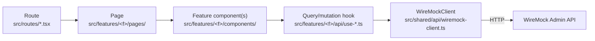
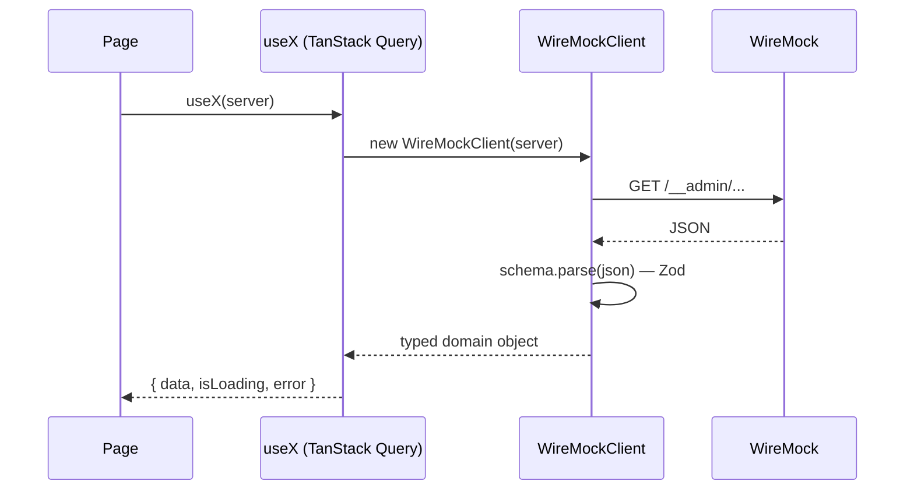
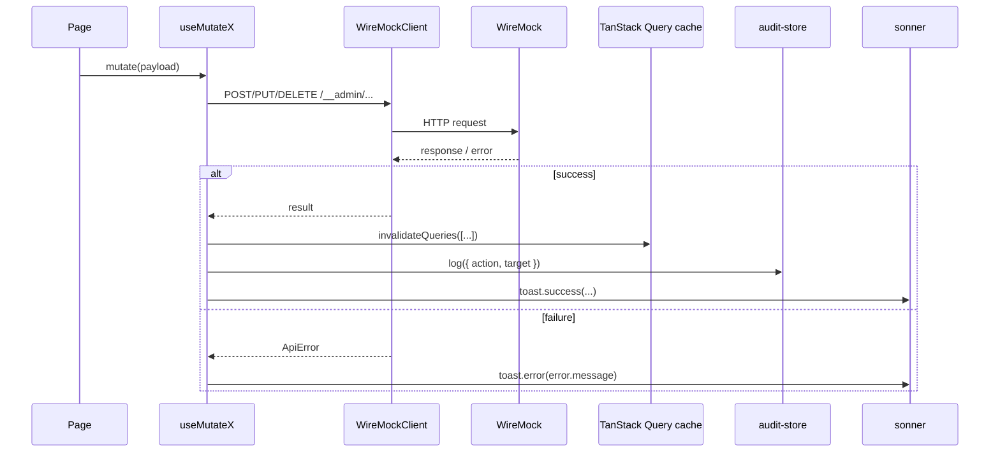

# Data Flow

## General shape

Every feature follows the same layering, from a route down to WireMock:

A route is a one-line shell pointing at a page; a page composes feature
components and calls that feature's hooks; hooks are the only place
`WireMockClient` gets instantiated. No component calls Axios or
`WireMockClient` directly — see
[WireMock Integration](/architecture/wiremock-integration).

## Read path

If WireMock returns something the Zod schema can't parse, the query
resolves as an error (a Zod validation error), not with malformed data —
see [Error Handling](#error-handling-path) below.

## Write path (mutation)

This exact shape repeats across every mutation hook in the codebase
(create/update/delete mapping, save/delete file, reset scenario, start/
stop recording, update settings, …) — see
[Conventions](/ai/conventions) for the pattern to follow when adding a new
one.

## Worked example: creating a mapping

1. User fills out the request matcher and response in
   `MappingEditorPage` (`src/features/mappings/pages/mapping-editor-page.tsx`),
   held in local `useState`.
2. Clicking **Save mapping** calls `useCreateMapping(server).mutate(mapping)`
   (`src/features/mappings/api/use-mappings.ts`).
3. The hook builds a `WireMockClient` for the active server and calls
   `client.mappings.create(mapping)`, which `POST`s to
   `/__admin/mappings` and parses the response with `stubMappingSchema`.
4. On success: the `['mappings', server.id, server.baseUrl]` query is
   invalidated (so the list page refetches), an audit entry
   ("Created Stub") is logged, a success toast appears, and the page
   navigates back to `/mappings`.
5. On failure: an error toast shows the normalized `ApiError` message
   (e.g. a WireMock validation error, or "Unable to reach WireMock
   server…" for a network failure) and the user stays on the editor with
   their unsaved changes intact.

## Error handling path

`src/shared/api/http.ts`'s response interceptor is the single place raw
Axios/WireMock failures become a typed `ApiError`:

| Situation                                                     | `ApiError.code` | Surfaced as                                                                                                                                 |
| ------------------------------------------------------------- | --------------- | ------------------------------------------------------------------------------------------------------------------------------------------- |
| Request timed out (15s)                                       | `timeout`       | "Request timed out"                                                                                                                         |
| No response at all (server down, wrong URL, DNS/CORS failure) | `network`       | "Unable to reach WireMock server. Check the URL and that the server is running."                                                            |
| WireMock returned a non-2xx HTTP status                       | `http`          | WireMock's own error message when present (with a rewritten, actionable message for filesystem permission errors), otherwise the HTTP error |
| Anything else                                                 | `unknown`       | "Unexpected error"                                                                                                                          |

From there:

- **Queries**: TanStack Query exposes the error via `error`/`isError`;
  every page checks it and renders an inline error message instead of (or
  alongside) its normal content — there is no global "toast on every
  query error" behavior, to avoid duplicate/noisy toasts on background
  polling failures.
- **Mutations**: every mutation hook's `onError` shows a `sonner` toast
  with the error's message, and does **not** invalidate any query — the
  UI keeps whatever it had before the failed attempt.
- **Render errors**: caught by `GlobalErrorBoundary` (full-page fallback)
  or, when scoped to a route, `RouteErrorComponent` (fallback inside the
  outlet, shell stays visible) — see
  [Routing](/architecture/routing#fallback-components).

See [Security](/architecture/security) for what happens when the _active
server itself_ becomes unreachable mid-session, and
[Debugging](/development/debugging) for tracing a failure back through
this chain during development.
