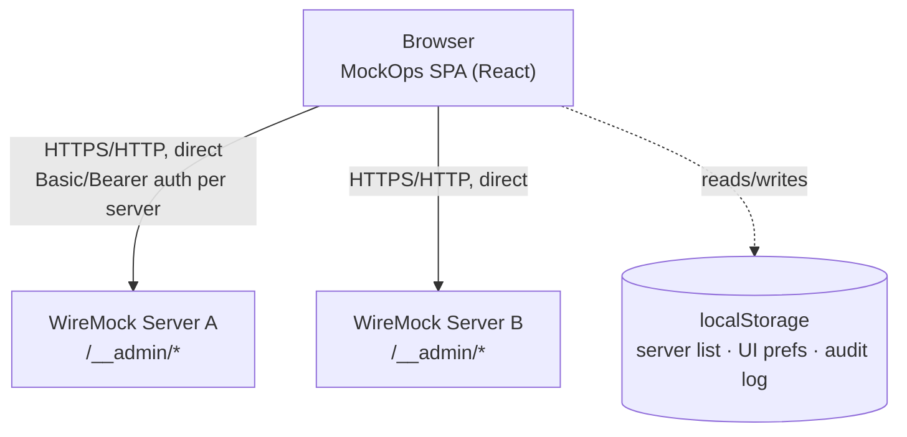

# System Architecture

## What MockOps is

MockOps is a **client-only single-page application**. There is no MockOps
backend, database, or server-side process of any kind — every screen calls
WireMock's Admin REST API (`/__admin/...`) directly from the browser.



Static assets (the compiled app) are served by whatever static host you
deploy MockOps to — a reference Nginx setup is included (see
[Deployment → Docker](/deployment/docker)) — but that host never sits
between the browser and WireMock at request time. It only ever serves the
SPA's own HTML/JS/CSS.

## No backend, no proxy

This is the single most important fact about MockOps' architecture, and it
shapes everything else:

- Every WireMock Admin API call originates **from the browser tab running
  MockOps**, using the base URL and credentials you configured for that
  server.
- There is no MockOps-side component that could add logging, rate
  limiting, or centralized authorization in front of WireMock.
- CORS is therefore relevant: WireMock's Admin API generally works without
  explicit CORS configuration for typical setups, but a WireMock instance
  behind a restrictive reverse proxy may need CORS headers configured for
  the origin MockOps is served from.

See [Security](/architecture/security) for the full implications, and
[WireMock Integration](/architecture/wiremock-integration) for exactly how
the browser-to-WireMock calls are made.

## Major pieces

| Layer              | Location                                                | Role                                                                                                               |
| ------------------ | ------------------------------------------------------- | ------------------------------------------------------------------------------------------------------------------ |
| Routing            | `src/routes/`                                           | TanStack Router file-based routes; root layout renders the app shell                                               |
| Feature modules    | `src/features/<name>/`                                  | One folder per domain area — servers, dashboard, mappings, files, requests, scenarios, recordings, settings, audit |
| HTTP layer         | `src/shared/api/http.ts`                                | Per-server Axios instance + error normalization                                                                    |
| WireMock SDK       | `src/shared/api/wiremock-client.ts`                     | Typed sub-clients covering every WireMock Admin API area MockOps uses                                              |
| Domain schemas     | `src/shared/types/wiremock.ts`                          | Zod schemas + inferred types for the WireMock domain model                                                         |
| Server-state cache | TanStack Query (`src/features/*/api/use-*.ts`)          | Caches WireMock responses, drives polling/refetch                                                                  |
| Client state       | Zustand (`src/shared/stores/`, `src/features/*/store/`) | Servers, UI prefs, audit log — persisted to `localStorage`                                                         |
| UI primitives      | `src/shared/components/ui/`                             | ShadCN-style components on Base UI + Tailwind v4                                                                   |

## Feature boundaries

```text
src/features/
├── servers/     # multi-server config, health checks
├── dashboard/   # live metrics & charts (aggregates other features' APIs)
├── mappings/    # stub mapping CRUD, visual + JSON editors, templating UI
├── files/       # __files browser/editor
├── requests/    # request journal + near misses
├── scenarios/   # scenario state view/reset/set
├── recordings/  # recording start/stop/snapshot
├── settings/    # global WireMock settings + server actions + console theme
└── audit/       # local, per-browser audit log
```

There is no separate "templates" feature folder — response templating is a
section of the mappings feature's response editor. See
[Response Templating](/features/templates).

## Persistence

| What                                                             | Where                  | Mechanism                                |
| ---------------------------------------------------------------- | ---------------------- | ---------------------------------------- |
| WireMock's own data (stubs, journal, scenarios, files, settings) | The WireMock server    | Not persisted by MockOps at all          |
| Configured servers + active server                               | Browser `localStorage` | Zustand `persist`, key `mockops-servers` |
| UI preferences (theme, sidebar, command palette)                 | Browser `localStorage` | Zustand `persist`, key `mockops-ui`      |
| Local audit log (max 500 entries)                                | Browser `localStorage` | Zustand `persist`, key `mockops-audit`   |
| In-flight WireMock API responses                                 | In-memory only         | TanStack Query cache, lost on reload     |

See [State Management](/architecture/state-management) for the full
breakdown.

## Deployment model

MockOps ships as a container image built in two stages: a Node stage
compiles the static assets, and an Nginx stage serves them on port 8080.
Kubernetes manifests and a Helm chart deploy that image behind a
`ClusterIP` Service and optional `Ingress`. See
[Deployment](/deployment/docker).
