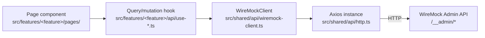
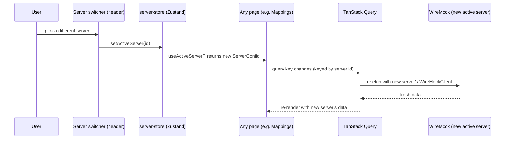

# WireMock Integration

## Call chain

Every WireMock operation in MockOps follows the same path:

There is no code path in the repository that bypasses `WireMockClient` to
call WireMock directly from a component or another hook — it is the single
boundary where untyped WireMock JSON becomes typed domain objects.

## The HTTP layer

`src/shared/api/http.ts::createHttpClient(server: ServerConfig)` builds an
Axios instance per server:

- `baseURL` = the server's configured base URL, trailing slashes stripped.
- 15-second timeout, `Content-Type: application/json`.
- Auth: `basic` sets `instance.defaults.auth`; `bearer` sets a static
  `Authorization: Bearer <token>` header; `none` sets nothing.
- A response interceptor normalizes every failure into an `ApiError`
  (`network` | `timeout` | `http` | `parse` | `unknown`), and rewrites raw
  WireMock filesystem-permission exceptions
  (`AccessDeniedException`/`FileSystemException`) into an actionable
  message about checking WireMock's storage directory permissions.

## The `WireMockClient` SDK

`src/shared/api/wiremock-client.ts` exports `WireMockClient`, constructed
per-request with a `ServerConfig` (a new instance per hook call — there is
no client caching/reuse across calls). It composes six sub-clients over
one shared Axios instance:

| Sub-client   | Admin API endpoints                                                                                                                                                                     | Notes                                      |
| ------------ | --------------------------------------------------------------------------------------------------------------------------------------------------------------------------------------- | ------------------------------------------ |
| `mappings`   | `GET/POST /mappings`, `GET/PUT/DELETE /mappings/{id}`, `DELETE /mappings`, `POST /mappings/reset\|save\|import`, `POST /mappings/find-by-metadata\|remove-by-metadata`                  |                                            |
| `files`      | `GET /files`, `GET/PUT/DELETE /files/{name}`                                                                                                                                            | Path segments are individually URL-encoded |
| `scenarios`  | `GET /scenarios`, `POST /scenarios/reset`, `PUT /scenarios/{name}/state`                                                                                                                |                                            |
| `requests`   | `GET /requests`, `GET/DELETE /requests/{id}`, `DELETE /requests`, `POST /requests/count`, `GET /requests/unmatched`, `GET /requests/unmatched/near-misses`, `POST /near-misses/request` |                                            |
| `recordings` | `GET /recordings/status`, `POST /recordings/start\|stop\|snapshot`                                                                                                                      |                                            |
| `system`     | `GET/POST /settings`, `GET /health`, `GET /version`, `POST /shutdown`, `POST /reset`                                                                                                    | `shutdown` has no UI action wired to it    |

Every read response is parsed through the matching Zod schema in
`src/shared/types/wiremock.ts` before it reaches a hook — a malformed or
unexpected WireMock response surfaces as a Zod parse error rather than
silently propagating bad data into the UI.

## Server selection

There is no "current server" concept inside `WireMockClient` itself — it's
purely a function of which `ServerConfig` you construct it with. Every
query/mutation hook takes `server: ServerConfig | null` as an argument and
is called with `useActiveServer()`
(`src/features/servers/store/server-store.ts`), so switching the active
server is just a matter of a different `ServerConfig` flowing into the same
hooks on the next render — see
[State Management](/architecture/state-management) and
[Multi-Server Flow](#multi-server-flow) below.

## Authentication

Per-server `authType` (`none` | `basic` | `bearer`) and its credentials
live on `ServerConfig` and are applied by `createHttpClient` on every
request to that server — see [Security](/architecture/security) for how
those credentials are stored and what MockOps can and cannot enforce with
them.

## Health checks

`src/features/servers/api/use-server-health.ts::useServerHealth` polls
`system.health()` every 30 seconds; if the target WireMock doesn't expose
`/__admin/health` (older versions), it falls back to listing one mapping
to confirm reachability. The result is written back into the server's
`lastConnectionStatus`/`lastConnectionAt`/`version` fields in the server
store as a side effect (not during render).

## Multi-server flow

Because every query key includes `server?.id` (e.g.
`['mappings', server?.id, server?.baseUrl]`), switching servers doesn't
require any manual cache invalidation — TanStack Query treats it as an
entirely different set of queries and fetches fresh data automatically.
The previous server's data stays cached (subject to normal garbage
collection) so switching back doesn't necessarily refetch immediately.

## Near-miss diagnostics: beyond the raw API

WireMock's `/near-misses/request` and `/requests/unmatched/near-misses`
return a candidate stub and a match _distance_, but not a field-level
reason. `src/features/requests/utils/near-miss-diagnostics.ts::
explainMismatch` re-evaluates the candidate's request pattern against the
logged request client-side — method, URL, headers, query parameters,
cookies, and simple body matchers — replicating WireMock's own matcher
semantics (full-string regex matching, "any value matches" for
multi-valued fields) closely enough to produce accurate "expected vs.
actual" explanations. Matchers requiring a JSON/XML engine
(`equalToJson`, `matchesJsonPath`, `matchesXPath`, `equalToXml`) are
deliberately skipped rather than approximated, to avoid false positives.

## What MockOps does not do

- It does not run, install, or manage WireMock itself.
- It does not cache or mirror WireMock's data anywhere durable — every
  view is a live read (subject to TanStack Query's cache) from the
  server's current state.
- It does not wire the `system.shutdown()` client method to any UI
  action, even though the method exists.
