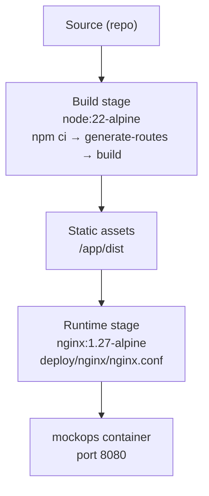

# Docker

MockOps ships as a **multi-stage Docker build**: a Node stage compiles the
static SPA, and an Nginx stage serves it. `Dockerfile` (repository root):



## Build stage

```dockerfile
FROM node:22-alpine AS build
WORKDIR /app
COPY package.json package-lock.json ./
RUN npm ci
COPY . .
RUN npm run generate-routes && npm run build
```

- `npm ci` for a reproducible install from `package-lock.json`, done
  before copying the rest of the source so this layer caches across builds
  that only change application code.
- `npm run generate-routes` runs explicitly before `npm run build` because
  the build script itself is `tsc -b && vite build`, and `tsc -b` needs
  the generated `src/routeTree.gen.ts` to resolve route types (see
  [Routing](/architecture/routing)).

## Runtime stage

```dockerfile
FROM nginx:1.27-alpine AS runtime
RUN rm -rf /usr/share/nginx/html/*
COPY --from=build /app/dist /usr/share/nginx/html
COPY deploy/nginx/nginx.conf /etc/nginx/conf.d/default.conf
EXPOSE 8080
HEALTHCHECK --interval=30s --timeout=3s --start-period=5s \
  CMD wget -qO- http://127.0.0.1:8080/ >/dev/null || exit 1
CMD ["nginx", "-g", "daemon off;"]
```

Only the compiled `dist/` output and the Nginx config cross into the final
image — no Node, no source, no `node_modules`.

## Nginx configuration (`deploy/nginx/nginx.conf`)

- Listens on **port 8080** (not the Nginx default 80).
- **SPA fallback**: `try_files $uri $uri/ /index.html;` for `location /`
  — required so client-side routes like `/mappings/new` resolve on a
  direct load or refresh (see [Routing](/architecture/routing)) instead
  of 404ing.
- **Aggressive caching for hashed assets**: `location /assets/` gets
  `Cache-Control: public, immutable` and a 1-year expiry, since Vite
  content-hashes those filenames; `location /` (i.e. `index.html`) gets
  `Cache-Control: no-cache` so a new deploy is picked up immediately.
- **Gzip** for text/JS/CSS/JSON/SVG/XML.
- **Security headers**: `X-Frame-Options: SAMEORIGIN`,
  `X-Content-Type-Options: nosniff`,
  `Referrer-Policy: strict-origin-when-cross-origin`, a restrictive
  `Permissions-Policy` (geolocation/microphone/camera all disabled). See
  [Security](/architecture/security) for what's _not_ covered (no CSP).
- `GET /healthz` returns a plain `200 ok` — used by the Docker
  `HEALTHCHECK` and by the Kubernetes probes (see
  [Kubernetes](/deployment/kubernetes)).

## Runtime configuration

There is **no runtime environment-variable configuration** for the
container — WireMock server connections are entered inside the running
app and stored in the browser (see
[Reference → Environment Variables](/reference/environment-variables)).
The image is fully static; the same image works in every environment.

## Building and running locally

```bash
docker build -t mockops .
docker run -p 8080:8080 mockops
```

or, using the reference compose file (which also starts a local WireMock
instance):

```bash
docker compose up --build
```

App available at `http://localhost:8080`.

## Pre-built images

Published to GitHub Container Registry by CI (`.github/workflows/ci.yml`)
on every push to `main` and on tags matching `v*`:

```bash
docker run -p 8080:8080 ghcr.io/ahimsarijalu/mockops:latest
docker run -p 8080:8080 ghcr.io/ahimsarijalu/mockops:1.2.3
```

Tags follow [Semantic Versioning](https://semver.org/):
`latest` (only from `main`), `<major>.<minor>.<patch>`,
`<major>.<minor>`, and `<major>` — generated by `docker/metadata-action`
in the `docker` CI job. See
[Reference → Architecture Decisions](/reference/architecture-decisions)
and `AGENTS.md`'s "Versioning & releases" section for how a release tag
maps to these image tags.
