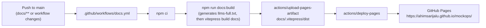

# GitHub Pages (this site)

This page documents how the documentation site you're reading is itself
built and deployed — separate from deploying the MockOps _application_
(see [Docker](/deployment/docker), [Kubernetes](/deployment/kubernetes),
[Helm](/deployment/helm)).

## Pipeline



## Workflow: `.github/workflows/docs.yml`

A **separate** workflow from `ci.yml` (application CI is untouched — see
[Architecture Decisions](/reference/architecture-decisions)), using the
official GitHub Pages actions:

- `actions/checkout` (`fetch-depth: 0`, needed for VitePress's
  `lastUpdated` git-history lookup)
- `actions/setup-node` (Node 22, matching `ci.yml`)
- `actions/configure-pages`
- `actions/upload-pages-artifact` — uploads `docs/.vitepress/dist`
- `actions/deploy-pages` — deploys to the repository's GitHub Pages
  environment

**Triggers**: pushes to `main` that touch `docs/**`, `package.json`,
`package-lock.json`, or the workflow file itself, plus a manual
`workflow_dispatch`. Pull requests only run the build (to catch a broken
docs build in review) — the deploy job runs on `main` only.

**Permissions** (least-privilege, no long-lived tokens):

```yaml
permissions:
  contents: read
  pages: write
  id-token: write
```

`concurrency` is set so a new push waits for any in-flight docs deploy to
finish rather than cancelling it — a Pages deployment is never
interrupted mid-way.

## Base path

The site is a **project page** (`https://ahimsarijalu.github.io/mockops/`,
not a user/org root page), so `base: '/mockops/'` is set in
`docs/.vitepress/config.ts`. This must stay in sync with the repository
name — if the repository is ever renamed, update `base` to match.

Internal links in every doc page use root-relative paths (e.g.
`/architecture/overview`, not `../architecture/overview` or a hardcoded
`https://ahimsarijalu.github.io/mockops/architecture/overview`) — VitePress
resolves and prefixes these with `base` automatically at build time, so
they keep working regardless of where the site is hosted.

## Clean URLs

`cleanUrls` is **not** enabled — every page builds to its own `<name>.html`
and links keep the `.html` extension. This is a deliberate choice for a
plain static host: it guarantees direct navigation and page refresh work
for every URL without depending on GitHub Pages resolving
extension-less paths, at the cost of slightly less pretty URLs.

## `llms.txt` and `llms-full.txt`

- `docs/public/llms.txt` is a hand-written, static file (following the
  [llmstxt.org](https://llmstxt.org) convention) listing the documentation
  site's key pages — served at `/mockops/llms.txt`.
- `docs/public/llms-full.txt` is **generated**, not hand-maintained:
  `docs/.vitepress/generate-llms-full.mjs` concatenates every documentation
  page into one plain-text file, run automatically as the first step of
  `npm run docs:build`. It's gitignored, since it's a build artifact of
  the docs themselves — regenerating it is part of every docs build,
  local or CI.

## Building and previewing locally

```bash
npm run docs:dev       # dev server with hot reload
npm run docs:build     # production build to docs/.vitepress/dist
npm run docs:preview   # serve the production build locally
```

`docs:build` and `docs:preview` both respect the configured `base`, so a
local preview serves the site under `/mockops/` just as GitHub Pages does
— visit `http://localhost:4173/mockops/` (or whatever port `docs:preview`
reports) after running `docs:build`.

## Enabling Pages on the repository

The workflow deploys to the repository's GitHub Pages **environment**; it
does not itself flip the repository setting on. In the repository's
**Settings → Pages**, the source must be set to **GitHub Actions** (not
"Deploy from a branch") for `actions/deploy-pages` to have anywhere to
publish to.
