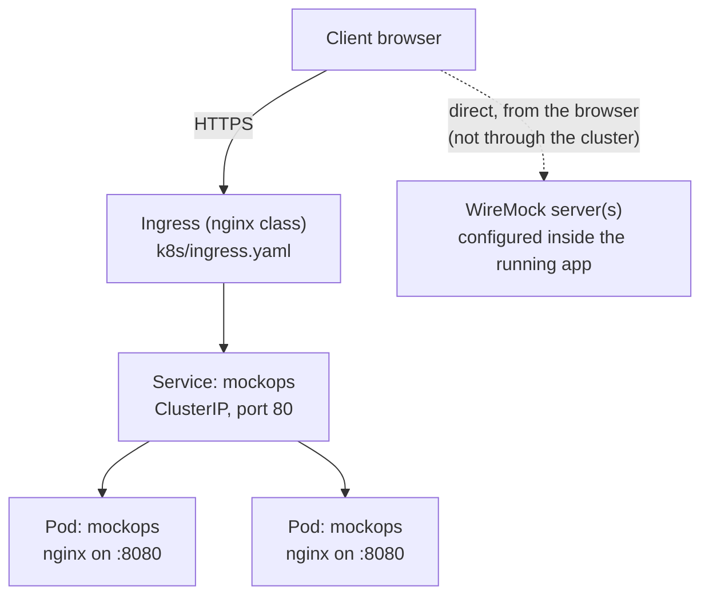

# Kubernetes

Plain manifests live in `k8s/`, assembled with Kustomize
(`k8s/kustomization.yaml`). For a templated, configurable install, see
[Helm](/deployment/helm) instead — the Helm chart's templates mirror these
same manifests.

## Resources

| File                  | Kind         | Notes                                                                             |
| --------------------- | ------------ | --------------------------------------------------------------------------------- |
| `k8s/namespace.yaml`  | `Namespace`  | `mockops`                                                                         |
| `k8s/deployment.yaml` | `Deployment` | 2 replicas, `ghcr.io/ahimsarijalu/mockops:latest`                                 |
| `k8s/service.yaml`    | `Service`    | `ClusterIP`, port 80 → container port `http` (8080)                               |
| `k8s/ingress.yaml`    | `Ingress`    | `nginx` ingress class, host `mockops.example.com`, TLS via a `mockops-tls` secret |

There is **no `ConfigMap` or `Secret`** in these manifests — MockOps needs
no runtime configuration (see [Docker](/deployment/docker)), so there's
nothing to inject that way.

## Networking



The cluster only ever serves the static MockOps SPA. WireMock traffic
never passes through the Ingress/Service/Pod — every WireMock Admin API
call is made directly from the browser to whatever base URL you configure
inside the running app (see
[System Architecture](/architecture/overview)). Deploying MockOps to
Kubernetes says nothing about where your WireMock servers run; they don't
have to be in the same cluster, or reachable through it, as long as your
browser can reach them.

## Probes

Both readiness and liveness probes hit `GET /healthz` (port `http`, i.e. 8080) — the endpoint Nginx returns a plain `200 ok` for (see
[Docker](/deployment/docker)):

```yaml
readinessProbe:
  httpGet: { path: /healthz, port: http }
  initialDelaySeconds: 2
  periodSeconds: 10
livenessProbe:
  httpGet: { path: /healthz, port: http }
  initialDelaySeconds: 5
  periodSeconds: 20
```

## Resources

```yaml
resources:
  requests: { cpu: 50m, memory: 64Mi }
  limits: { cpu: 250m, memory: 256Mi }
```

Sized for a static-file-serving Nginx container — no application server
memory pressure to account for, since there's no backend process.

## Security context

```yaml
securityContext:
  runAsNonRoot: true
  runAsUser: 101 # nginx's non-root user in the nginx:1.27-alpine image
  allowPrivilegeEscalation: false
  readOnlyRootFilesystem: true
  capabilities:
    drop: ['ALL']
```

Because the root filesystem is read-only, three `emptyDir` volumes are
mounted for the paths Nginx needs to write to at runtime:
`/var/cache/nginx`, `/var/run`, and `/tmp`.

## Ingress and TLS

`k8s/ingress.yaml` sets `nginx.ingress.kubernetes.io/ssl-redirect: 'true'`
and a `tls` block referencing a `mockops-tls` secret — that secret is
**not created by these manifests**; it must be provisioned separately
(e.g. cert-manager, or manually) before the Ingress can serve HTTPS. The
host is set to the placeholder `mockops.example.com` and must be changed
to your real hostname.

## Applying the manifests

```bash
kubectl apply -k k8s/
```

## Adjusting replicas, resources, or the image

Edit `k8s/deployment.yaml` directly, or use Kustomize overlays/patches on
top of `k8s/kustomization.yaml` — these manifests are not templated with
Helm-style values. For a configuration-driven install, use the
[Helm chart](/deployment/helm) instead.
